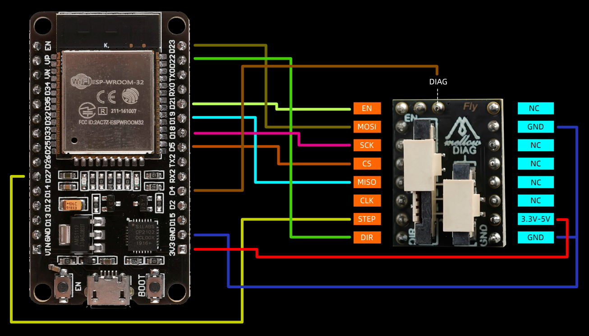

# TMC5160 Stepper Stand

**[🇷🇺 Русская версия](README_RU.md)** | **[🇬🇧 English](README.md)**

ESP32-based stepper motor test stand with TMC5160 driver control via web interface.

## 🎯 Features

- **Web Interface** - Control motor via WiFi (Access Point mode)
- **TMC5160 Driver** - Full SPI control with Motion Controller mode
- **Circular Control** - Beautiful circular angle control interface (16 segments × 22.5°)
- **Motor Presets** - Pre-configured settings for NEMA 8/14/17/23 motors
- **Real-time Monitoring** - Position, speed, and status updates
- **EEPROM Storage** - Save motor settings persistently
- **Gear Ratio Support** - Control motors through gearboxes and belt drives
- **Mobile Optimized** - Responsive design for phones and desktop

## 📱 Interface

### Circular Angle Control (16 segments × 22.5°)

```
                  0°
                  🔵
                  
      -45°               +45°
       🟣                   🔵
         
   -90° 🟣────────●────────🔵 +90°
         
       🟣                   🔵
      -135°             +135°
      
                 🔵
                ±180°
```

- **Positive angles (+)** - Clockwise rotation (blue segments)
- **Negative angles (-)** - Counter-clockwise rotation (purple segments)
- **Center display** - Shows current position
- **22.5° precision** - 16 segments for accurate positioning

## 🛠️ Hardware

### Required Components
- **ESP32 DevKit v1** (or compatible)
- **TMC5160 driver** - **Mellow Fly 24V/48V HV TMC5160 Pro V1.5**
- **Stepper motor** (NEMA 8/14/17/23)
- **Power supply** (24-48V for TMC5160 HV version)

### Wiring (TMC5160 SPI Mode)


*Complete wiring schematic*

```
ESP32        TMC5160 Pro V1.5
-----        ---------------
GPIO23   ->  MOSI (SDI)
GPIO19   ->  MISO (SDO)
GPIO18   ->  SCK
GPIO5    ->  CS
GPIO21   ->  EN (Enable, active LOW)
GPIO4    ->  DIAG (StallGuard, optional for sensorless homing)
GND      ->  GND
5V       ->  VCC_IO (logic 3.3-5.5V)

VM       ->  24-48V (motor power)
VSA      ->  12V (fan, optional)
```

**⚠️ IMPORTANT:** 
- **CUT** the `SD_MODE` jumper (it has internal pull-up to VIO by default) - driver will pull to GND itself for SPI mode!
- **DIAG pin (GPIO4)** - Optional, for StallGuard sensorless homing detection
- Driver supports **24-48V** high voltage input

## 🚀 Getting Started

### 1. Install PlatformIO
```bash
pip install platformio
```

### 2. Clone and Build
```bash
git clone https://github.com/lizardjazz1/TMC5160-Stepper-Stand.git
cd TMC5160-Stepper-Stand
pio run -t upload
pio run -t uploadfs
```

### 3. Connect to WiFi
- Network: `Krya`
- Password: `12345678`
- Open browser: `http://192.168.4.1`

## ⚙️ Configuration

### Motor Settings (src/config.h)
```cpp
#define TMC5160_RSENSE 0.033f      // Sense resistor (Ω)
#define DEFAULT_CURRENT_MA 800     // Motor current (mA)
#define DEFAULT_MICROSTEPS 16      // Microstepping
#define DEFAULT_MAX_SPEED 1000     // Max speed (steps/s)
```

### WiFi Settings (src/config.h)
```cpp
#define WIFI_AP_SSID "Krya"
#define WIFI_AP_PASSWORD "12345678"
#define WIFI_AP_IP "192.168.4.1"
```

## 📊 Motor Presets


*Pre-configured settings for popular NEMA motors*

| Motor | Current | Hold | Microsteps | Speed |
|-------|---------|------|------------|-------|
| NEMA 8 | 600mA | 30% | 32 | 300 steps/s |
| NEMA 14 | 700mA | 40% | 16 | 350 steps/s |
| NEMA 17 | 800mA | 50% | 16 | 400 steps/s |
| NEMA 23 | 2500mA | 60% | 8 | 600 steps/s |

## 🎮 Usage


*Main control panel with motor parameters*

### Basic Control
1. **Enable Motor** - Click "🔋 Enable Motor (HOLD)"
2. **Set Parameters** - Adjust speed, acceleration, steps
3. **Move** - Click "🚀 Start" or use angle buttons
4. **Stop** - Click "⏹️ Stop"

### Angle Control
- Click any angle button (+22.5°, +45°, -90°, etc.)
- Motor rotates by that angle
- **+** = clockwise, **-** = counter-clockwise

### Gear Ratio Support
- Enter gear ratio for gearboxes/belt drives
- **1.0** = direct drive (no gearbox)
- **3.0** = 1:3 gearbox (motor 3 revs → output 1 rev)
- **0.333** = 3:1 reverse (motor 1 rev → output 3 revs)

### Save Settings
- Load a preset: "📋 Load Preset"
- Adjust parameters manually
- Click "💾 Save Settings"

## 🔧 API Endpoints

| Endpoint | Method | Description |
|----------|--------|-------------|
| `/api/status` | GET | Get motor status |
| `/api/move` | POST | Move motor (steps) |
| `/api/enable` | POST | Enable motor |
| `/api/disable` | POST | Disable motor |
| `/api/stop` | POST | Stop movement |
| `/api/reset` | POST | Reset position |
| `/api/save_settings` | POST | Save to EEPROM |
| `/api/save_gear_ratio` | POST | Save gear ratio |

## 🔍 TMC5160 Pro V1.5 Features

- **Voltage:** 24-48V (high voltage version)
- **Current:** Up to 3A RMS per phase
- **SPI Speed:** 100 kHz (stable operation)
- **Mode:** Motion Controller (internal step generation)
- **SpreadCycle** - Quiet and precise operation
- **StallGuard4** - Sensorless load detection and homing (via DIAG pin)

## 📷 Screenshots

### Desktop View

*Full desktop interface with all controls*

### Mobile View

*Responsive mobile interface*

### Status Monitoring

*Real-time position and speed monitoring*

## 📂 Project Structure

```
TMC5160-Test-Stand/
├── data/
│   ├── index.html      # Web interface
│   └── favicon.png     # Favicon (1KB PNG)
├── src/
│   ├── main.cpp        # Main program
│   ├── tmc.cpp/.h      # TMC5160 driver control
│   ├── web_server.cpp/.h  # Web server & API
│   ├── config.h        # Configuration
│   └── pins.h          # Pin definitions
├── README.md           # English documentation
├── README_RU.md        # Russian documentation
└── platformio.ini      # PlatformIO config
```

## 📝 License

MIT License - feel free to use and modify!

## 🙏 Credits

- **TMC5160 Library** - [tommag/TMC5160_Arduino](https://github.com/tommag/TMC5160_Arduino)
- **ESPAsyncWebServer** - [ESP32Async](https://github.com/ESP32Async/ESPAsyncWebServer)
- **ArduinoJson** - [bblanchon](https://github.com/bblanchon/ArduinoJson)

## 📧 Support

For issues and questions, please open an issue on GitHub.

